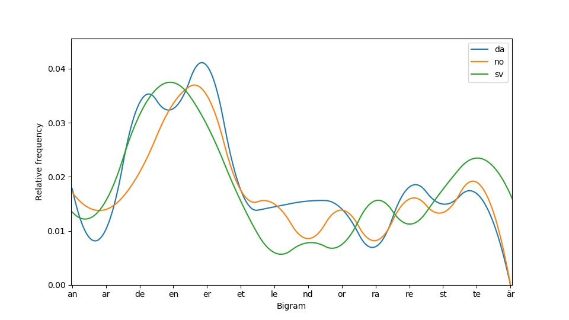

# Wikipedia frequency analysis

Small project that 1) extracts text in a given language from random Wikipedia articles 
and 2) performs simple frequency analysis by plotting a distribution of the most frequent n-grams 
given a list of languages and text samples.

## Getting Started

### Installing

This project was developed using Python 3.7.1. The list of required packages and versions used are specified in `requirements.txt` and can be installed using pip

```
pip install -r requirements.txt
```

## Examples

### Extracting text from Wikipedia

Text can be extracted from random wiki articles using `wiki.py`, which by default uses a simple regex tokenizer to extract words from paragraphs found using `BeautifulSoup`.
To extract 2k paragraphs from Danish, Swedish and Norwegian respectively, you can run the following code:

```bash
python wiki.py da no sv 2000
```

where the first argument(s) specif(ies/y) the language(s) from which text should be extracted and the last argument decides the number of paragraphs.


### Frequency analysis

An example of how to use the wiki samples are given in `ngrams.py`. Here, character bigrams are extracted from the samples in `resources`, which includes 2k randomly extracted paragraphs from Danish, Swedish and Norwegian Wikipedia articles:

```python
from freq_analysis import plot_freq_distr

languages = ["da", "no", "sv"]
ngrams = []
n = 2

for lang in languages:

	with open("resources/wiki_{}.txt".format(lang)) as f:
		paragraphs = [line.strip() for line in f.readlines()]

	ngrams.append([])

	for p in paragraphs:
		for word in p.split():
			ngrams[-1].extend(extract_ngrams(word.lower(), n))

plot_freq_distr(ngrams, languages, rel_freq=True, interpolate=(2,300), sort_by_freq=False, most_common=10)
```

which produces the following plot:


